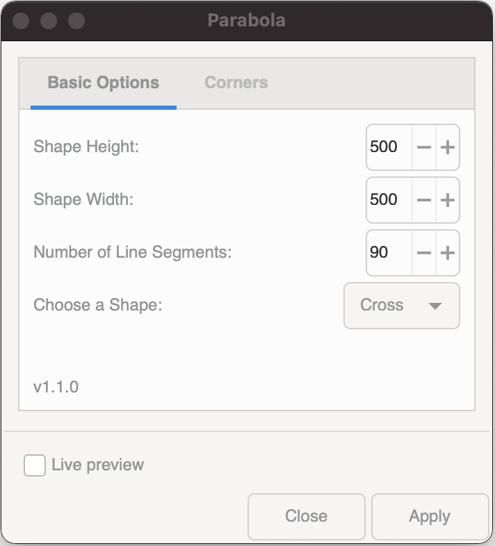
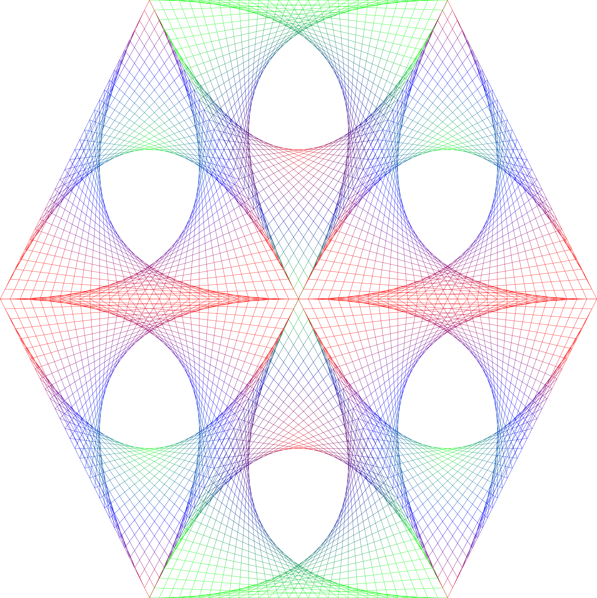

# Parabola v1.1.0

Parabola is an [Inkscape](https://inkscape.org) extension that renders a series of lines in selected shapes to form an optical illusion of a curved line (Parabolic lines)

**NOTE:** *Parabola was developed on a Macintosh and it has been tested on the following platforms:*

* MacOS Big Sur + Inkscape 1.0 - *No issues found*
* Ubuntu Linux + Inkscape 1.0.1 - *Live Preview experience has issues*
* Windows 10 + Inkscape 1.0.2 - *No issues found*

## How to install
To install parabola, place the following files in your Inkscape extensions folder and then restart Inkscape.

On **Linux** or **Windows** you can find your Inkscape extensions folder listed at Edit => Preferences => System: User extensions.

On **MacOS** you can find your Inkscape extensions folder under Inkscape => Preferences => System: User extensions.

* [parabola.inx](https://github.com/opensourcebear/inkscape-extension-parabola/blob/main/parabola.inx)
* [parabola.py](https://github.com/opensourcebear/inkscape-extension-parabola/blob/main/parabola.py)

## Parabola usage
### Starting the Parabola extension

Parabola is accessed from the extensions menu.  Go to Extensions => Render => Parabola

If Parabola doesn't appear in the render list, check that you have installed both files listed above in the correct folder, and that Inkscape has been restarted.

### Configuring your render
Parabola will allow you to set the following options:

1. Shape Height - Overall height of object (100 - 1000)
2. Shape Width - Overall width of the object (100 - 1000)
3. Number of line segments (5 - 100)
4. Shape - Cross, Square, or Triangle

*Versions prior to v1.1.0 included an option to enable/disable a border - a path that outlines the shape. This feature was removed and now a border is only drawn based on the corners chosen.*

**Hint:** Turn on live preview and observe how the preview result will appear as you change settings to become more familiar with the options.

### Corners
On the Corners tab of the Parabola settings you can mix and match which corners are rendered. 

### Example Renders

**Triangle Shape with 3 corners active**

**NOTE:** Renders are all black, the color seen here was added as a gradient stroke after rendering.

**Cross Shape with 4 corners active**

**NOTE:** Renders are all black, the color seen here was added as a gradient stroke after rendering.

**Square Shape with 4 corners active**

**Square Shape with 2 corners active**

**Hexagon Shape made from joining 6 triangle shapes**

**NOTE:** Hexagon is not a shape produced by this plugin, but manually grouping shapes together can produce new shapes.  Renders are all black, the color seen here was added as a gradient stroke after rendering.

**Multi-point Star**

**NOTE:** This Multi-point star is not a shape produced by this plugin, but manually grouping shapes together can produce new shapes.  Renders are all black, the color seen here was added as a gradient stroke after rendering.
