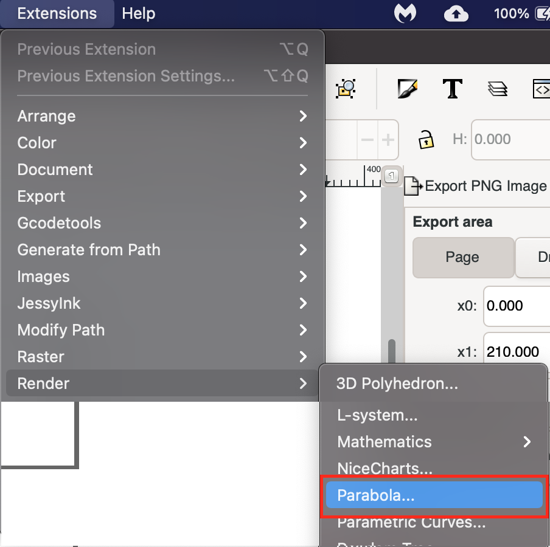
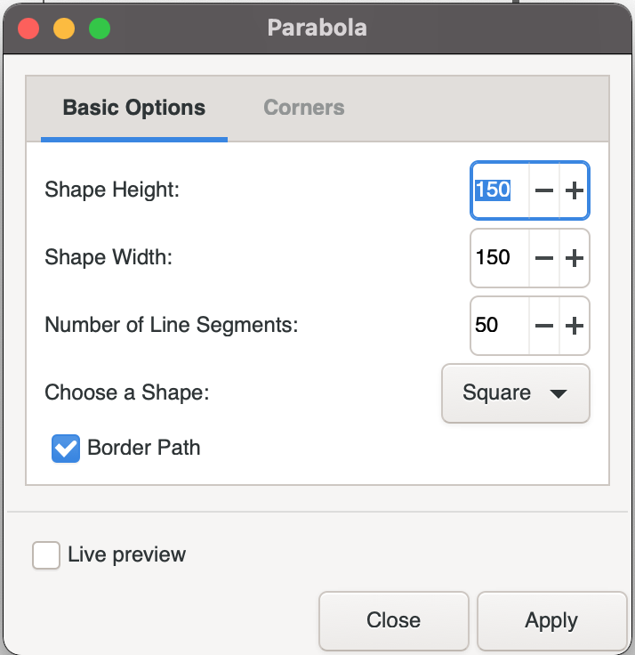
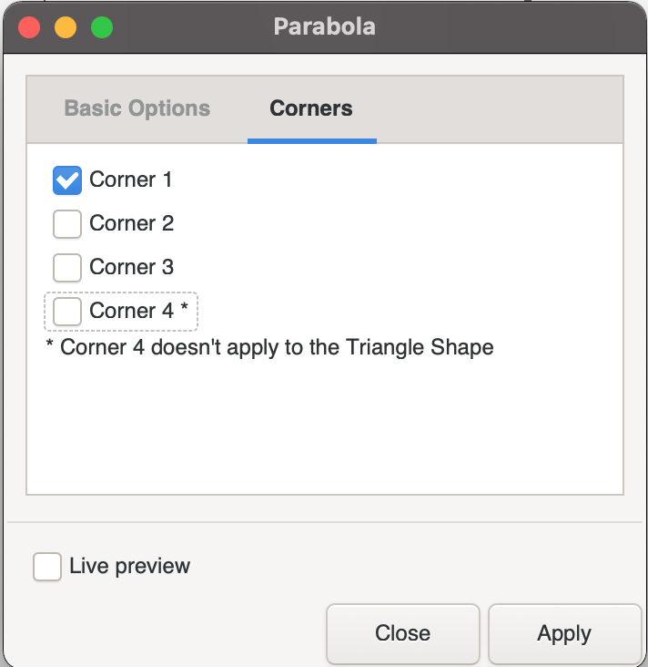
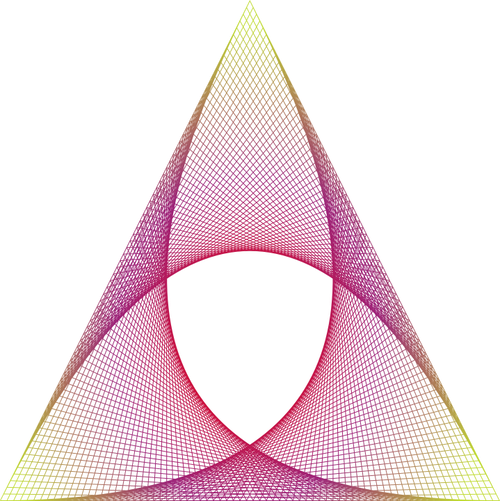
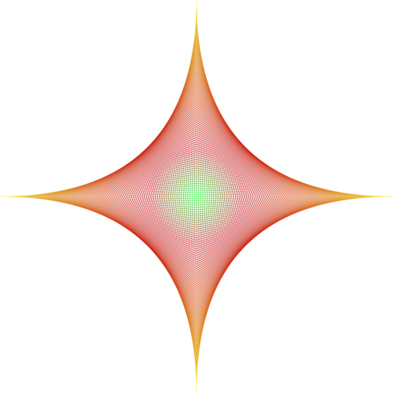

# Parabola

Parabola is an Inkscape extension that renders a series of lines in selected shapes to form an optical illusion of a curved line (Parabolic lines)

[parabola on github](https://github.com/opensourcebear/inkscape-extensions/tree/main/parabola)

**NOTE:** *Parabola was developed on a Macintosh running Inkscape version 1.0.  It has NOT been tested on any other platforms or Inkscape versions*

## How to install
To install parabola, place the following files in your Inkscape extensions folder and then restart Inkscape.

You can find your Inkscape extensions folder listed at Edit > Preferences > System: User extensions.

* [parabola.inx](https://github.com/opensourcebear/inkscape-extensions/tree/main/parabola/parabola.inx)
* [parabola.py](https://github.com/opensourcebear/inkscape-extensions/tree/main/parabola/parabola.py)

## Parabola usage
### Starting the Parabola extension

Parabola is accessed from the extensions menu.  Go to Extensions => Render => Parabola

If Parabola doesn't appear in the render list, check that you have installed both files listed above in the correct folder, and that Inkscape has been restarted.

### Configuring your render
Parabola will allow you to set the following options:

1. Shape Height - Overall height of object (100 - 1000)
2. Shape Width - Overall width of the object (100 - 1000)
3. Number of line segments (5 - 100)
4. Shape - Cross, Square, or Triangle
5. Border - a path that outlines the shape. At this time, not having the border may cause undesirable edges.

**Hint:** Turn on live preview and observe how the preview result will appear as you change settings to become more familiar with the options.

### Corners
On the Corners tab of the Parabola settings you can mix and match which corners are rendered. 

### Example Renders

####Triangle Shape with 3 corners active

**NOTE:** Renders are all black, The color seen here was added as a gradient stroke after rendering.

####Cross Shape with 4 corners active

**NOTE:** Renders are all black, The color seen here was added as a gradient stroke after rendering.

####Square Shape with 4 corners active

